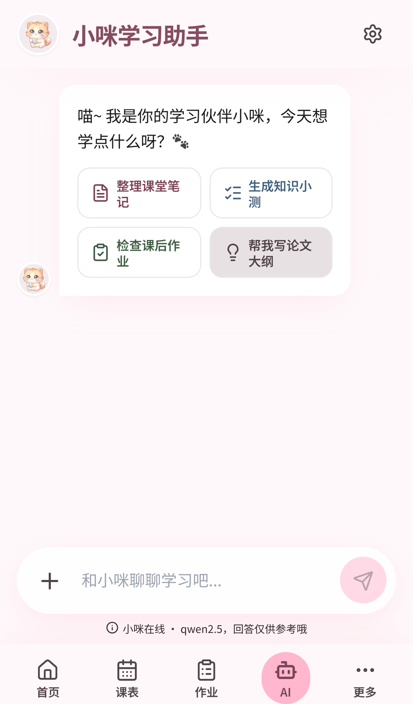

<div align="center">
  
  <h1>ScholarFlow Mobile</h1>
  <p>
    <strong>端侧 AI 学习助手 · 手机端 · 完全离线</strong><br />
    <sub>On-device AI study companion · iOS · fully offline</sub>
  </p>

  <p>
    <a href="docs/competition/">📄 比赛方案</a> &nbsp;·&nbsp;
    <a href="https://github.com/Health-525/scholarflow">🖥️ 桌面端主仓</a> &nbsp;·&nbsp;
    <a href="https://github.com/Health-525/scholarflow-mobile/issues/new">🐛 Issues</a>
  </p>

  <p>
    <a href="LICENSE"></a>
    
    
    
  </p>
</div>

---

<p align="center">
  <a href="#中文">中文</a> ·
  <a href="#english">English</a>
</p>

<table align="center">
  <tr>
    <td align="center" width="33%">
      <br />
      <sub><b>📒 首页 · 学业聚合</b></sub>
    </td>
    <td align="center" width="33%">
      <br />
      <sub><b>🐱 AI 助手 · 离线端侧</b></sub>
    </td>
    <td align="center" width="33%">
      <br />
      <sub><b>📅 课表 · 今日</b></sub>
    </td>
  </tr>
</table>

## 中文

### 这是什么

**ScholarFlow Mobile 是 ScholarFlow 的手机端。** 它把大学生分散在十几个 App 里的学业事务——课表、作业、考试、GPA、图书馆、笔记、番茄钟、日报——**聚合进一个 App**，再用一个**完全跑在手机本地、离线可用**的端侧 AI 助手，作为统一智能入口贯穿所有模块。

> 🖥️ 桌面端（Electron）在主仓 **[Health-525/scholarflow](https://github.com/Health-525/scholarflow)**；**本仓库专注手机端 + 端侧 AI**。
>
> 📱 **当前仅支持 iOS**（参赛机型 iPhone 15）；`android/` 为 Capacitor 脚手架，端侧推理尚未接入 Android。

### 一句话亮点

把大学生分散的学业全流程聚合到一端，再用一个随身、离线的端侧 AI 助手统一驱动——**免切换、免联网、免付费、数据不出端**。

### 为什么是「端侧」

| | |
| --- | --- |
| **离线可用** | 图书馆地下层 / 宿舍弱网照样用，推理零流量 |
| **零成本** | 本地推理、无限次，不需要云 AI 会员或按量付费 |
| **隐私** | 成绩、薄弱知识点、学习数据**不出端**，本地完成推理 |
| **懂你的上下文** | 学业数据与 AI 同处一端，可端侧个性化辅导（端侧 RAG 方向） |

### 端侧 AI 技术

- **模型**：`Qwen3-0.6B`（4-bit 量化、MNN 格式；主力端侧模型，比 1.7B 更轻、适配 iPhone 15 本地 CPU，约 0.4GB，从[魔搭 ModelScope](https://www.modelscope.cn/) 拉取、不入库；另备 `Qwen3-1.7B` 可选）
- **推理框架**：[MNN-LLM](https://github.com/alibaba/MNN)，CPU(NEON) 后端，逐 token 流式回调，跑在原生线程不阻塞界面
- **桥接**：Capacitor 原生插件（Swift → Obj-C++ → MNN C++）
- **后端抽象**：`useChat` → `ChatBackend`——手机走原生 MNN、桌面/开发走 Ollama，**同一套聊天 UI 零改动**
- **SME2 前瞻**：iPhone 15（A16/A17）走通用 NEON；在含 SME2 的 **M5 上实测验证 MNN 的 SME2 加速路径**，形成「今天 iPhone 15 可跑、未来无缝吃 SME2 提速」的同构演进

> 完整技术方案、性能口径与 SME2 指南见 **[`docs/competition/`](docs/competition/)**。

### 萌系「小咪」皮肤

移动端专属 kawaii 粉猫皮肤（仅 `@media max-width:767px` 生效，不影响桌面主题）：首页 / 课表 / AI 助手 / 更多 / 设置 全模块改皮。截图见 [`docs/competition/screenshots/`](docs/competition/screenshots/)。

### 功能总览

| 模块 | 说明 |
| --- | --- |
| 仪表盘 | 汇总课表、作业、考试倒计时、教务通知、最近日报 |
| 课表 | 今日视图、本周网格、日期查询、学期周次计算 |
| 作业 / 考试 | 快速新增、列表管理、完成状态追踪 |
| 成绩 / GPA | 教务同步、绩点展示、按学期查看 |
| 图书馆 | 阅览室状态、预约、暂离、取消、馆内消息 |
| 笔记 / 番茄钟 / 目标 | Markdown 笔记、专注计时、习惯追踪 |
| 日报 / 周报 | 学习数据沉淀与趋势复盘 |
| **AI 助手** | **贯穿全模块的端侧统一入口，离线即答** |

### 快速开始（手机端）

要求：Node 20+ ／ npm 10+ ／ Xcode（iOS，参赛机型 iPhone 15）／ `git-lfs`（拉模型用）

```bash
git clone https://github.com/Health-525/scholarflow-mobile.git
cd scholarflow-mobile
npm install

# 1) 拉端侧大模型（0.6B 主力 + 1.7B 可选，约 2GB，从魔搭；需 git-lfs）
npm run mobile:models

# 2) 构建并打开原生工程
npm run mobile:ios                       # iOS：构建 + 打开 Xcode
# 仅在浏览器里调手机 UI
npm run mobile:dev
```

> 大模型权重（`*.mnn.weight`）**不进 git**，克隆后跑一次 `npm run mobile:models` 即可补齐到 `ios/App/` 下。

### 技术栈

`Next.js 15` + `React 19` + `TypeScript` · `Tailwind CSS` + `shadcn/ui` · `Zustand` + `TanStack Query` · `Capacitor`（iOS）· **`MNN-LLM` + `Qwen3`（端侧）** · `Vitest` + `Playwright`

### 比赛

参加 **「手机上的创意AI」初赛**（参赛机型 iPhone 15）。技术方案文档、产品截图、MNN 开启 SME2 加速指南均在 **[`docs/competition/`](docs/competition/)**。

### 相关文档

- 桌面端主仓：[Health-525/scholarflow](https://github.com/Health-525/scholarflow)
- 学校接入指南：[docs/school-adapter-guide.md](docs/school-adapter-guide.md)
- 数据模型：[docs/DATA_MODEL.md](docs/DATA_MODEL.md)
- 安全说明：[SECURITY.md](SECURITY.md) ／ 贡献：[CONTRIBUTING.md](CONTRIBUTING.md)

---

## English

### What It Is

**ScholarFlow Mobile is the phone client of ScholarFlow.** It aggregates the academic chores a college student juggles across a dozen apps — schedule, assignments, exams, GPA, library, notes, pomodoro, reports — into **one app**, then drives every module through a single **on-device, fully-offline AI assistant**.

> 🖥️ The desktop (Electron) build lives in the main repo **[Health-525/scholarflow](https://github.com/Health-525/scholarflow)**. **This repo focuses on mobile + on-device AI.**
>
> 📱 **iOS only for now** (target device: iPhone 15). `android/` is a Capacitor scaffold; on-device inference is not wired to Android yet.

### Why On-Device

- **Offline** — works in library basements / weak dorm Wi-Fi; zero data usage for inference
- **Zero cost** — unlimited local inference, no cloud-AI subscription
- **Private** — grades and study data never leave the device
- **Context-aware** — academic data sits on the same device as the AI (on-device RAG direction)

### On-Device AI Stack

- **Model**: `Qwen3-0.6B` (4-bit, MNN format) — primary on-device model, lighter than 1.7B and sized for the iPhone 15 CPU (~0.4GB, pulled from ModelScope, not committed; `Qwen3-1.7B` available as a larger option)
- **Inference**: [MNN-LLM](https://github.com/alibaba/MNN) on CPU(NEON), token-streamed on a native thread
- **Bridge**: Capacitor native plugin (Swift → Obj-C++ → MNN C++)
- **Backend abstraction**: `useChat` → `ChatBackend` — native MNN on phone, Ollama on desktop/dev, **one chat UI, zero changes**
- **SME2-ready**: iPhone 15 runs generic NEON; the MNN SME2 acceleration path is validated on **M5 (SME2-capable)**

> Full technical writeup and SME2 guide in **[`docs/competition/`](docs/competition/)**.

### Quick Start

Requirements: Node 20+ / npm 10+ / Xcode (iOS, target device iPhone 15) / `git-lfs`.

```bash
git clone https://github.com/Health-525/scholarflow-mobile.git
cd scholarflow-mobile
npm install
npm run mobile:models                    # fetch on-device models (0.6B + optional 1.7B, ~2GB, git-lfs)
npm run mobile:ios                       # iOS: build + open Xcode```

### Tech Stack

`Next.js 15` + `React 19` + `TypeScript` · `Tailwind` + `shadcn/ui` · `Zustand` + `TanStack Query` · `Capacitor` (iOS) · **`MNN-LLM` + `Qwen3` (on-device)** · `Vitest` + `Playwright`

### Competition

Built for the **"Creative AI on Mobile"** preliminary round (target device: iPhone 15). Solution doc, screenshots, and the MNN SME2 guide are in **[`docs/competition/`](docs/competition/)**.

## License

MIT © 2026 [Health-525](https://github.com/Health-525)
