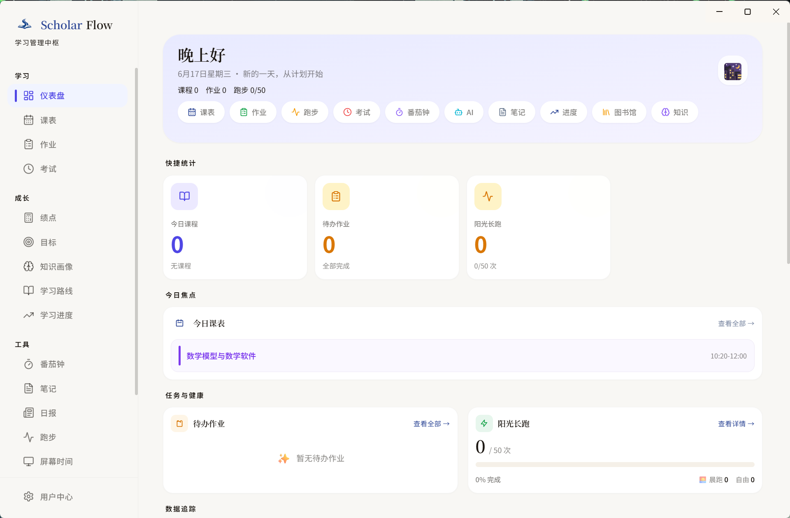

<div align="center">
  
  <h1>ScholarFlow</h1>
  <p><strong>面向大学生的本地优先学习中枢</strong></p>
  <p><strong>A local-first student workspace for campus life and study workflows</strong></p>

  <p>
    <a href="https://github.com/Health-525/scholarflow/releases">下载 Download</a> ·
    <a href="docs/school-adapter-guide.md">学校接入指南 Adapter Guide</a> ·
    <a href="https://github.com/Health-525/scholarflow/issues/new?template=bug_report.md">问题反馈 Issues</a> ·
    <a href="https://github.com/Health-525/scholarflow/issues/new?template=feature_request.md">功能建议 Requests</a>
  </p>

  <p>
    <a href="https://github.com/Health-525/scholarflow/actions/workflows/ci.yml"></a>
    <a href="LICENSE"></a>
    <a href="https://nodejs.org"></a>
    <a href="https://github.com/Health-525/scholarflow/releases"></a>
  </p>
</div>

---

<p align="center">
  <a href="#中文">中文</a> ·
  <a href="#english">English</a>
</p>



## 中文

### ScholarFlow 是什么

ScholarFlow 把大学生日常分散在教务系统、图书馆系统和个人效率工具里的信息，收束到一个本地优先、离线可用、桌面体验完整的工作台里。

它不是一个单点应用，而是围绕真实学习流程组织起来的学生工作台：

- 课表、考试、成绩来自教务系统
- 座位、预约、消息来自图书馆系统
- 作业、笔记、番茄钟、日报和周报统一管理
- 敏感数据优先保留在本地，而不是依赖第三方云端

### 为什么值得用

- 本地优先：学习数据默认存储在本地 SQLite
- 桌面增强：Electron 提供安全存储、自动更新、后台刷新和活动统计
- 工作流完整：不是单独的课表或待办，而是覆盖学习闭环
- 易于扩展：通过 `SchoolAdapter` 可以继续接入更多学校

### 适合谁

- 想把校园信息流和个人学习流放到一起的大学生
- 重视隐私、不愿托管教务账号和学习数据的用户
- 想验证校园效率产品方向的开发者
- 想扩展更多学校支持的贡献者

### 功能总览

| 模块 | 说明 |
| --- | --- |
| 仪表盘 | 汇总课表、作业、跑步、考试倒计时、教务通知、最近日报 |
| 课表 | 今日视图、本周网格、日期查询、学期周次计算 |
| 作业 | 快速新增、列表管理、完成状态追踪 |
| 考试 | 考试安排查看与管理 |
| 成绩 / GPA | 教务同步、绩点展示、按学期查看 |
| 图书馆 | 阅览室状态、预约、暂离、取消预约、馆内消息 |
| 笔记 | Markdown、搜索、自动保存 |
| 番茄钟 | 专注 / 休息循环计时 |
| 目标 / 跑步 | 习惯与目标追踪 |
| 日报 / 周报 | 学习数据沉淀与趋势复盘 |
| 设置 | 主题、数据导出、刷新策略、账户与设备信息 |

### 平台支持

| 能力 | Electron 桌面端 | Web / PWA | Android / Capacitor |
| --- | --- | --- | --- |
| 课表 / 成绩 / 考试同步 | 支持 | 支持 | 实验性 |
| 作业 / 目标 / 番茄钟 / 笔记 | 支持 | 支持 | 实验性 |
| 图书馆预约与 JWT 刷新 | 支持更完整 | 受浏览器限制 | 实验性 |
| 本地安全加密存储 | 支持 | 不完整 | 不完整 |
| 活动窗口统计 | 支持 | 不支持 | 不支持 |
| 后台自动刷新 | 支持 | 不支持 | 不支持 |

桌面版是主形态，Web / PWA 是补充形态。

### 快速开始

#### 直接使用

前往 [Releases](https://github.com/Health-525/scholarflow/releases) 下载 Windows 安装版或便携版。

#### 本地开发

要求：

- Node.js 20+
- npm 10+

```bash
git clone https://github.com/Health-525/scholarflow.git
cd scholarflow
npm install
```

启动 Web 开发环境：

```bash
npm run dev
```

启动 Electron 开发环境：

```bash
npm run abi:node
npm run electron:dev
```

验证命令：

```bash
npm run typecheck
npm run lint
npm test
npm run check
```

构建：

```bash
npm run electron:build
```

### 技术栈

- `Next.js 15` + `React 19` + `TypeScript`
- `Tailwind CSS` + `shadcn/ui` + `Base UI`
- `Zustand` + `TanStack Query`
- `Electron` + `better-sqlite3`
- `Capacitor` Android
- `Vitest` + `Playwright`

### 当前学校支持

- `njtech` - 南京工业大学
- `mock` - 本地开发与适配器调试

如果你想接入新的学校系统，请阅读 [docs/school-adapter-guide.md](docs/school-adapter-guide.md)。

### 安全说明

- 敏感凭证优先使用桌面端系统级加密存储
- Electron 使用 `contextIsolation: true` 与 `nodeIntegration: false`
- 内部 API 调用带内部 token 校验
- 图书馆登录与证书信任逻辑有显式边界控制

更多说明见 [SECURITY.md](SECURITY.md)。

### 贡献

欢迎 Issue 和 PR。

- [CONTRIBUTING.md](CONTRIBUTING.md)
- [docs/school-adapter-guide.md](docs/school-adapter-guide.md)
- [docs/DATA_MODEL.md](docs/DATA_MODEL.md)
- [SECURITY.md](SECURITY.md)

## English

### What ScholarFlow Is

ScholarFlow is a local-first student workspace that brings together academic data, library workflows, and personal study tools into one desktop-oriented product.

It is designed around real student workflows rather than a single feature:

- schedules, exams, and grades from academic systems
- seats, reservations, and notices from library systems
- assignments, notes, focus timers, and reports in one place
- sensitive data kept local whenever possible

### Why It Matters

- Local-first: study data is stored in local SQLite by default
- Desktop-native: secure storage, auto-update, background refresh, and activity tracking
- Workflow-oriented: covers the full study loop instead of one isolated task
- Extensible: more schools can be added through `SchoolAdapter`

### Who It Is For

- students who want campus data and personal productivity in one place
- privacy-conscious users who do not want to outsource academic data
- developers exploring student productivity products
- contributors who want to support more universities

### Feature Summary

| Module | Description |
| --- | --- |
| Dashboard | Unified overview of schedules, assignments, running, countdowns, notices, and recent reports |
| Schedule | Today view, weekly grid, date query, semester week calculation |
| Assignments | Quick add, list management, completion tracking |
| Exams | Exam schedule viewing and management |
| Grades / GPA | Grade sync, GPA display, semester-based views |
| Library | Reading room status, reservations, leave/cancel actions, in-library messages |
| Notes | Markdown notes, search, autosave |
| Pomodoro | Focus / break timer |
| Goals / Running | Goal and habit tracking |
| Reports | Daily and weekly reporting |
| Settings | Themes, export, refresh strategy, account and device info |

### Platform Support

| Capability | Electron Desktop | Web / PWA | Android / Capacitor |
| --- | --- | --- | --- |
| Schedule / grades / exams sync | Supported | Supported | Experimental |
| Assignments / goals / pomodoro / notes | Supported | Supported | Experimental |
| Library reservation and JWT refresh | Better support | Browser-limited | Experimental |
| Local secure storage | Supported | Partial | Partial |
| Active window tracking | Supported | Not supported | Not supported |
| Background auto-refresh | Supported | Not supported | Not supported |

Desktop is the primary experience. Web / PWA is secondary.

### Quick Start

#### For Users

Download the Windows installer or portable build from [Releases](https://github.com/Health-525/scholarflow/releases).

#### For Developers

Requirements:

- Node.js 20+
- npm 10+

```bash
git clone https://github.com/Health-525/scholarflow.git
cd scholarflow
npm install
```

Start the Web dev server:

```bash
npm run dev
```

Start the Electron dev environment:

```bash
npm run abi:node
npm run electron:dev
```

Validation:

```bash
npm run typecheck
npm run lint
npm test
npm run check
```

Build:

```bash
npm run electron:build
```

### Tech Stack

- `Next.js 15` + `React 19` + `TypeScript`
- `Tailwind CSS` + `shadcn/ui` + `Base UI`
- `Zustand` + `TanStack Query`
- `Electron` + `better-sqlite3`
- `Capacitor` Android
- `Vitest` + `Playwright`

### Current School Support

- `njtech` - Nanjing Tech University
- `mock` - local development and adapter testing

If you want to add a new school integration, read [docs/school-adapter-guide.md](docs/school-adapter-guide.md).

### Security

- sensitive credentials use desktop-level secure storage where available
- Electron uses `contextIsolation: true` and `nodeIntegration: false`
- internal API calls are protected by an internal token layer
- library login and certificate trust logic are explicitly scoped

See [SECURITY.md](SECURITY.md) for full details.

### Contributing

Issues and pull requests are welcome.

- [CONTRIBUTING.md](CONTRIBUTING.md)
- [docs/school-adapter-guide.md](docs/school-adapter-guide.md)
- [docs/DATA_MODEL.md](docs/DATA_MODEL.md)
- [SECURITY.md](SECURITY.md)

## License

MIT © 2026 [Health-525](https://github.com/Health-525)
